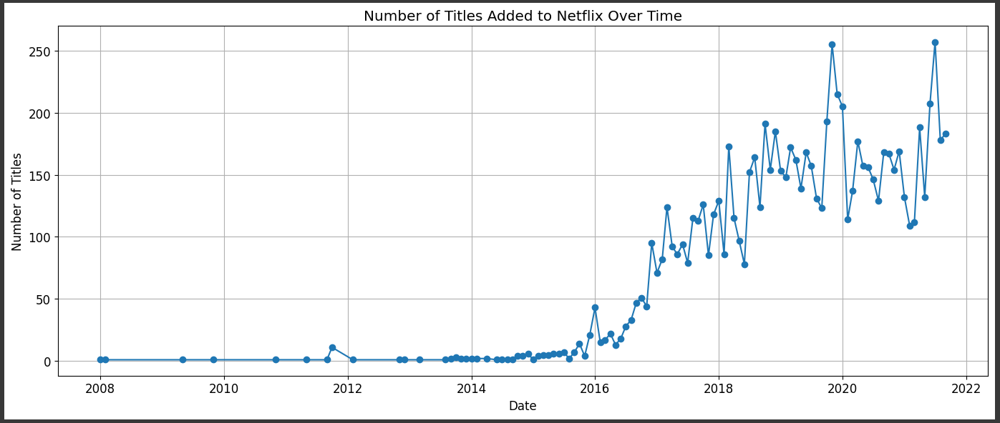
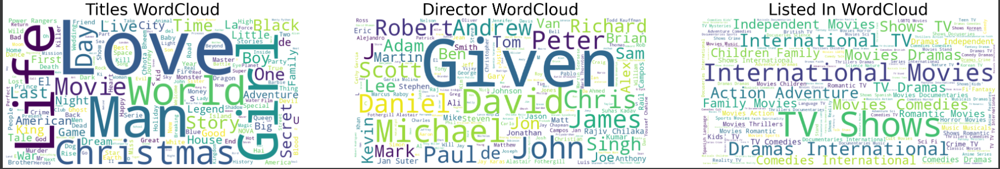

# Project: Netflix Analytics


## 📋 Table of Sections

1. [Data Analysis](#📊-data-analysis)
2. [Library](#📚-library)
3. [Dataset](#📁-dataset)
5. [Visualization of Analysis](#🖼️-visualization-of-analysis)
6. [Clone this Repo](#🧬-clone-this-repo)

---

### 📊 Data Analysis

In this project, we have focused mainly on data analysis. We analyzed various things such as:

- Counts in data
- Distribution of data
- Frequency in genres
- Wordcloud
- Content addition with respect to year
- And many more

---

### 📚 Library

```python
pip install numpy pandas matplotlib seaborn
pip install scikit-learn
```

---

### 📁 Dataset

**Dataset Link:** [Click here to view the dataset](https://drive.google.com/file/d/1cWcK8cddROe_DSv5zH5Fk7od32tK3ftf/view)

**Dataset Description:**

This dataset contains information about movies and TV shows on Netflix. Key columns include:
- show_id: Unique identifier for each entry.
- type: Content type (Movie or TV Show).
- title: Name of the movie or TV show.
- director: Director(s) of the content.
- country: Country of production.
- date_added: Date added to the platform.
- release_year: Year of release.
- rating: Age rating (e.g., PG-13, TV-MA).
- duration: Duration (in minutes for movies, seasons for TV shows).
- listed_in: Genres/categories (e.g., Documentaries, Dramas, Comedies).

### 🖼️ Visualization of Analysis

The following visualizations were created to analyze the dataset and many other in the Notebook:

1. **Number of Titles Added on Netflix Over Time**  
   This plot shows the trend of how many titles were added to the platform over time.

   

2. **Wordclouds**  
   A 1-row, 2-column grid of wordclouds displaying:
   - **Titles Wordcloud**  
   - **Directors Wordcloud**  
   - **Listed In Wordcloud**  
   
   

### 🧬 Clone this Repo
```bash
git clone https://github.com/UmerSalimKhan/Analysis-of-Netflix-Data.git
cd "Analysis-of-Netflix-Data"
```

Once this is done, install the library given above.
